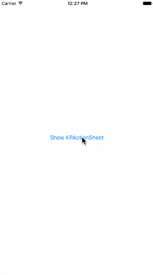

# KPActionSheet

A replacement of default action sheet, but has very simple usage.



## Todo

Add more custom affects and styles.

## Installation

#### CocoaPods
**KPActionSheet** is available through [CocoaPods](http://cocoapods.org). To install
it, simply add the following line to your Podfile:

```ruby
pod 'KPActionSheet', git: 'https://github.com/khuong291/KPActionSheet'
```

#### Manually
1. Download and drop needed files in your project.  
2. Congratulations!

#### Usage

```swift
let kpActionSheet = KPActionSheet(items: [
            KPItem(title: "Hello guys 😎", onTap: { 
                print("Hello guys 😎")
            }),
            KPItem(title: "Hello girls 😇", onTap: {
                print("Hello girls 😇")
            }),
            KPItem(title: "Cancel", type: .Cancel)
        ])
        present(kpActionSheet, animated: true, completion: nil)
```  

## Contributor

It would be greatly appreciated when you make a pull-quest  🤗

## Author

Khuong Pham, dkhuong291@gmail.com

## License

**KPActionSheet** is available under the MIT license. See the [LICENSE](https://github.com/khuong291/KPActionSheet/blob/master/LICENSE.md) file for more info.